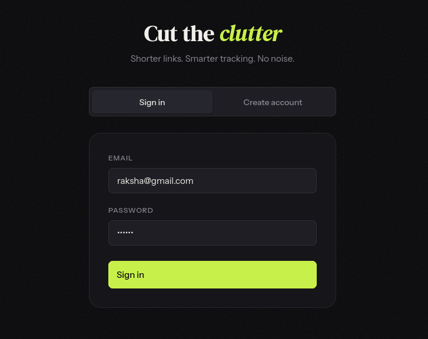
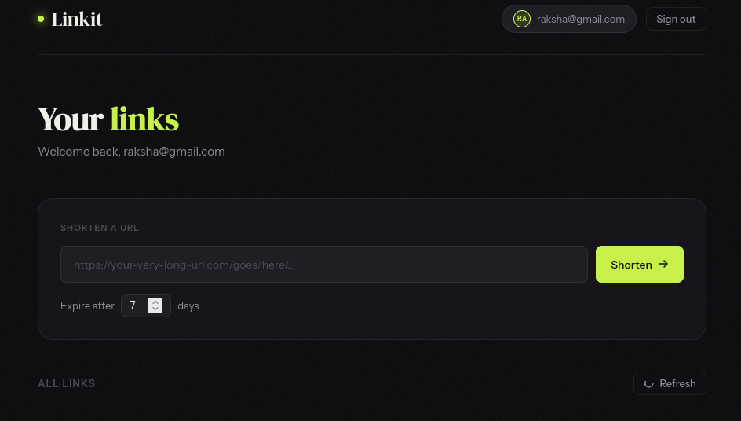
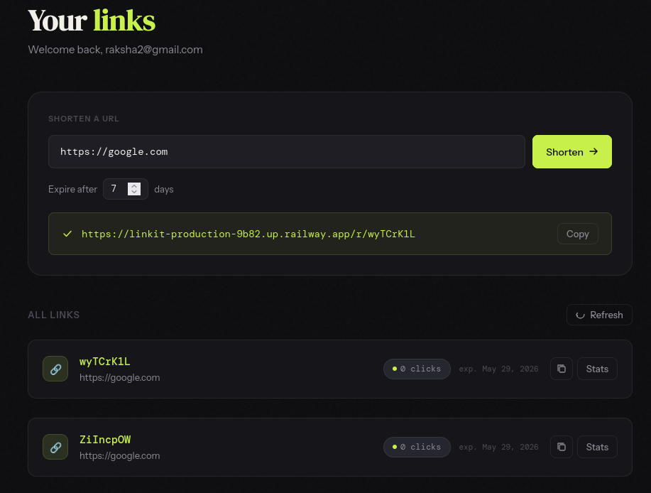
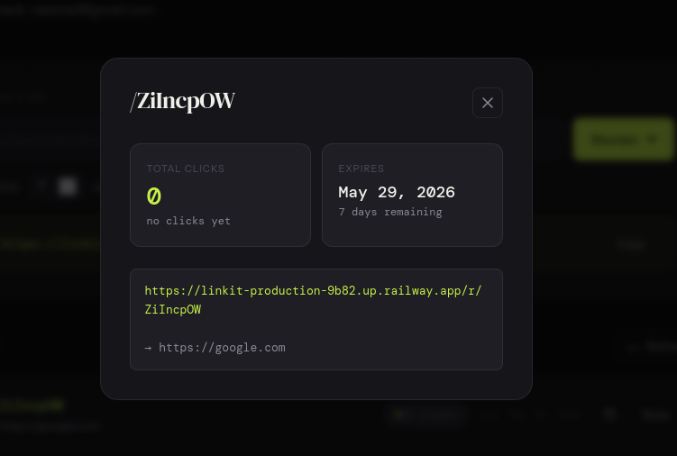

# 🌠 Linkit 

A **super super scalable URL shortener system!**

 **Can't trust?** [Try Linkit!](https://linkit-production-9b82.up.railway.app/)

---

## Special Thanks To


---

## 🌷 What is Linkit?

**Linkit** is a distributed URL shortener system designed like a real-world production backend.

It demonstrates:
-  High-performance caching
-  Scalable system design
-  Secure authentication
-  Analytics tracking
-  Load-balanced architecture

---

## How It Looks

### Login/Signup
JWT based authentication!

---



### Home
The cleanest UI ever!

---


### Shorten
Shorten any link in 0.000001 seconds!

---


### Stats
Monitor the click count and expiry time!

---



##  Features

###  Authentication
- JWT-based login system
- Password hashing
- Protected routes

---

###  Distributed Architecture
- Multiple FastAPI instances (horizontal scaling 🌱)
- Traefik load balancing traffic like a pro 
- Shared PostgreSQL database 
- Redis cache layer for lightning speed 

---

###  Performance & Scaling
- Redis caching for instant redirects
- Rate limiting to prevent abuse 
- Stateless backend design (scale freely)

---

###  URL Shortening Magic
- Generate unique short links 
- Optional expiration time 
- Fast redirection system
- Click tracking per link 

---

###  Analytics Dashboard
- Click counter per URL
- Real-time stats endpoint
- Track what’s popular 

---

##  System Architecture

Client --> Traefik Load Balancer --> FastAPI (multiple containers) --> Redis (cache layer) --> PostgreSQL


---

## API Endpoints

### Auth
- POST /auth/register
- POST /auth/login

### URLs
- POST /shorten
- GET /r/{short_code}
- GET /stats/{short_code}

##  Tech Stack

-  FastAPI
-  PostgreSQL
-  Redis
-  Docker & Docker Compose
-  SQLAlchemy + Alembic
-  HTML + Tailwind CSS
-  Traefik

---

## Setup & Run

### Clone repository

```bash
git clone https://github.com/Raksha-Karn/Linkit.git
cd url-shortener
```

### Start Docker Services

```bash
docker compose up --build
```

### Run Database Migrations

```bash
alembic upgrade head
```
### Launch Frontend
 - Open frontend/index.html

## Thanks!